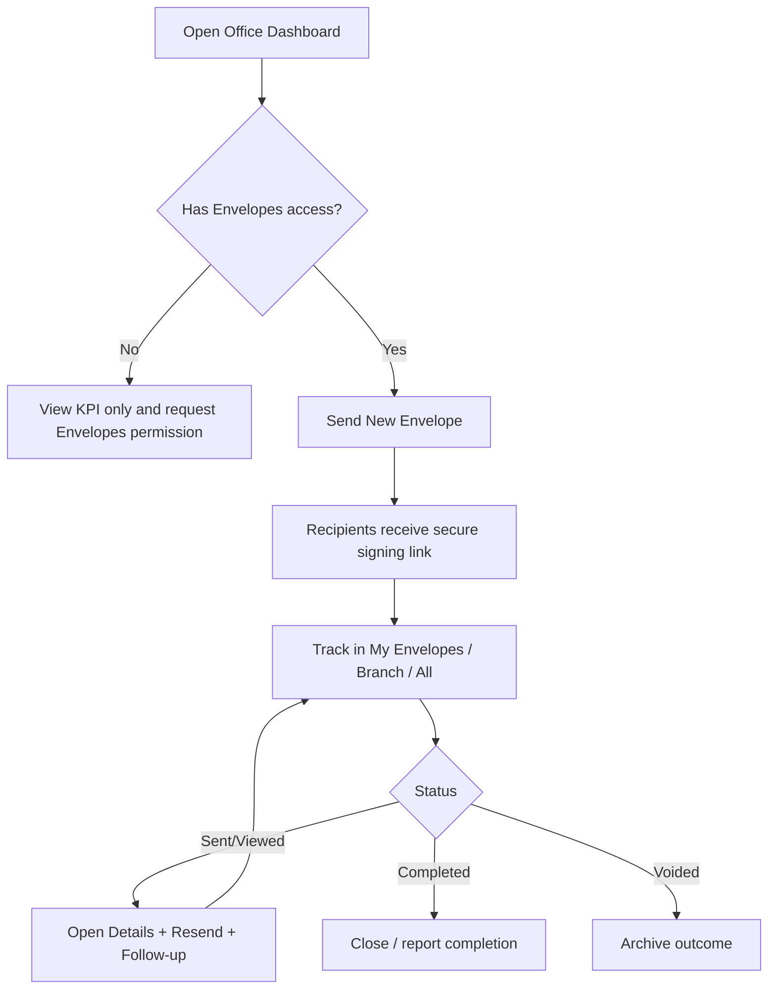

# Envelope Workflow for Office Roles

This workflow is designed for **Office Dashboard users** who need to create, send, monitor, and follow up on envelopes.

It explains what users can do based on access and how to run the process end-to-end.

---

## 1) Access model for Office users

Envelope workflow access is permission-based (not just role name).

## Minimum feature access needed

- **OfficeDashboard** → view Office Dashboard envelope KPIs and follow-up widgets.
- **Envelopes** → create/send envelopes and view envelope details.
- **EnvelopeTemplates** (optional) → manage templates.

## Practical outcome by permission

- **OfficeDashboard only**
  - Can view envelope metrics on Office Dashboard.
  - Cannot click envelope quick actions that require envelope access.
- **OfficeDashboard + Envelopes**
  - Full operational workflow: send new envelopes, view list/details, resend reminders, void (when allowed).
- **OfficeDashboard + Envelopes + EnvelopeTemplates**
  - Full workflow + template administration.

---

## 2) Where Office users do envelope work

## A) Office Dashboard (`/Office/Index`)
Primary monitoring and triage screen:

- Envelopes Sent This Month
- Completion Rate
- Pending Signatures
- Avg Time to Sign
- Status Breakdown chart
- Recent Envelope Activity
- Documents Needing Follow-up (pending 3+ days)

Quick Actions from dashboard:

- **Send New Envelope** → `/SignAdmin/Create`
- **View My Envelopes** → `/SignAdmin?scope=mine`
- **Manage Templates** (if allowed) → template management area

## B) Envelope list (`/SignAdmin`)
Primary operations list view with filters/scopes:

- Scope buttons: **Mine**, **Branch** (office manager+), **All** (management/admin roles)
- Filter by status and branch
- Open envelope details per row

For Office Staff and Sales roles, default scope is **Mine**.

## C) Envelope details (`/SignAdmin/Details/{id}`)
Primary follow-up/action page:

- View recipients and event history (opened/signed/etc.)
- Resend invitation emails
- Void/cancel envelope (disabled for Completed/Voided)

---

## 3) End-to-end Office Envelope workflow (daily execution)

## Step 1 - Start with Office Dashboard triage
1. Open Office Dashboard at start of day.
2. Check **Pending Signatures** and **Documents Needing Follow-up**.
3. Prioritize items by days pending (especially 7+ day items).

## Step 2 - Create and send envelope
1. Click **Send New Envelope**.
2. Select template.
3. Fill context (property/order/customer/location as needed).
4. Add recipients with role, email, and signer order.
5. Confirm subject/message/expiration.
6. Submit **Create & Send**.

What happens in app:
- Envelope is created and sent through signing service.
- Recipients receive secure signing link via email.

## Step 3 - Track recipient progress
1. Go to **View My Envelopes** (or Branch/All if your role allows).
2. Filter for statuses needing action (typically Sent/Viewed).
3. Open envelope details to review recipient progress and event log.

## Step 4 - Follow-up process
For envelopes still in **Sent** or **Viewed**:

1. Open details.
2. Click **Resend Emails**.
3. Optionally follow up outside system (phone/text) with recipients.
4. Recheck status later in the day.

Dashboard follow-up helper:
- “Documents Needing Follow-up” automatically highlights envelopes sent 3+ days ago and still pending.

## Step 5 - Completion and closure
1. Monitor for **Completed** status.
2. Validate all expected signers are completed.
3. If envelope is no longer needed and not completed, use **Void** with reason.
4. Keep list clean by filtering completed/voided items during weekly review.

---

## 4) Suggested Office cadence

## Daily (10-15 min)
- Review Pending Signatures and Follow-up list.
- Resend reminders for aging items.
- Confirm newly sent envelopes entered “Sent”.

## Twice weekly
- Review branch-level queue (if your role allows Branch scope).
- Escalate recurring delays to manager.

## Weekly
- Use dashboard metrics to report:
  - sent volume,
  - completion rate,
  - average time to sign,
  - open follow-up count.

---

## 5) Office role playbook by scenario

## Scenario A: New form request comes in
- Create envelope immediately from dashboard quick action.
- Set clear subject and recipient order.
- Send and verify it appears in recent activity.

## Scenario B: Recipient says they never got email
- Open envelope details.
- Click **Resend Emails**.
- Validate recipient email address and ask them to check spam.

## Scenario C: Envelope stuck for several days
- Use follow-up panel to identify aging item.
- Resend and contact recipient directly.
- Escalate if still pending after repeated attempts.

## Scenario D: Sent by mistake
- Open details.
- Void envelope (if not Completed/Voided already).
- Document reason in operations notes.

---

## 6) Access troubleshooting checklist

If Office user cannot perform envelope actions:

1. Confirm they have **OfficeDashboard** permission (for dashboard).
2. Confirm they have **Envelopes** permission (for send/view/follow-up actions).
3. Confirm **EnvelopeTemplates** only when template management is needed.
4. Verify location assignment if branch-specific visibility is expected.

---

## 7) Office workflow map (quick visual)

---

## 8) Related docs

- Envelope technical setup: `Documentation/SIGN_AND_SEND_SETUP.md`
- Feature overview: `Documentation/FEATURES_README.md`
- Permissions update notes: `Migrations/FEATURE_PERMISSIONS_UPDATE_README.md`

